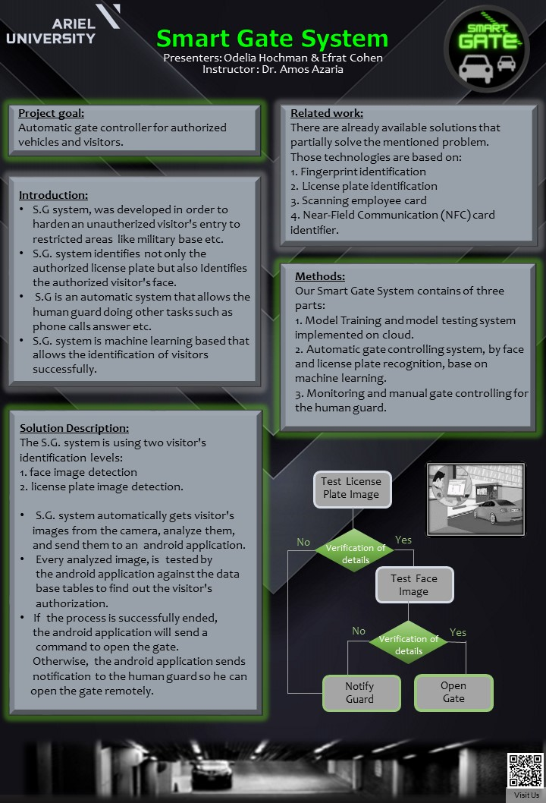

# Smart Gate System  

Final academic project at Ariel University 2021.

**Created by:**

[Odelia Hochman](https://github.com/OdeliaHochman)

[Efrat Cohen](https://github.com/EfratCohen100)

**Instructor:** Dr. Amos Azaria

## Motivation

Nowadays there are lot of visitors controlling systems that are based on license plate recognition such as exist in malls and hotels.
But when dealing with secured areas as like defense industry military base etc, the above method is insufficient, because it lets a car thieve or a terrorist who stole licensed car, to enter the secured area easily.

Due to that, we’ve developed the S.G system, that not only identifies the license plate but also Identifies the entering visitors face.
Such an automatic system allows the human guard doing other tasks such as phone calls answer, filling security reports etc.
The human guard rarely has to manage the visitor entry manually only in case when the automatic system fails to recognize the license plate of the car or the entering person.

## Poster

